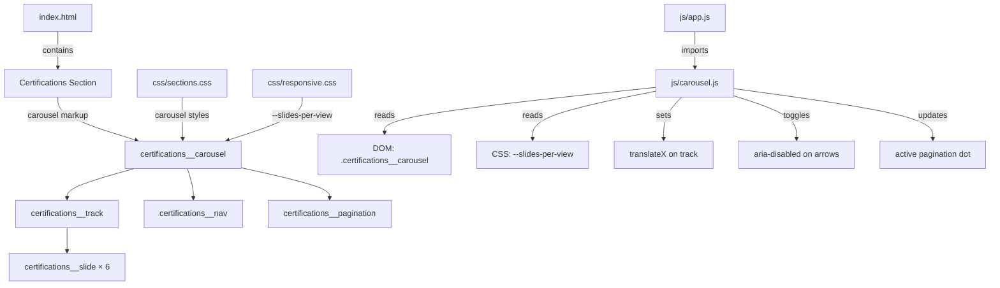

# Design Document: Certification Carousel

## Overview

This feature replaces the existing certifications flex grid (`certifications__grid`) with an interactive carousel component. The carousel displays 6 correct certification badges (sourced from the CV PDF) in a horizontally sliding track with arrow navigation, pagination dots, touch/swipe support, keyboard navigation, and responsive breakpoints.

The implementation stays within the project's vanilla HTML/CSS/JS stack — no frameworks or libraries. All new elements follow BEM naming with the `certifications__` prefix. The carousel logic lives in a new `js/carousel.js` ES module, imported and initialized from `app.js`.

### Key Design Decisions

1. **CSS `translateX` for slide movement** — GPU-accelerated transforms avoid layout thrashing and produce smooth 60fps animations. The existing `--ease-out-quart` and `--duration-normal` variables drive the transition curve.
2. **Finite (non-wrapping) carousel** — Arrows disable at boundaries rather than looping. This is simpler, avoids confusing infinite scroll on a small 6-item set, and makes the pagination dots unambiguous.
3. **Slides-per-view driven by CSS + JS** — A CSS custom property `--slides-per-view` is set by media queries. JS reads it at init and on resize to compute track offset, keeping breakpoint logic in CSS where it belongs.
4. **Single source of truth for position** — The carousel state is a single `currentIndex` integer. All derived values (track offset, active dot, arrow disabled state, aria attributes) are computed from it.

## Architecture



### Module Interaction

| Module | Responsibility |
|---|---|
| `index.html` | Carousel HTML structure with ARIA attributes, 6 certification badge slides |
| `css/sections.css` | Carousel layout, track, slide, arrow, pagination, and badge styles |
| `css/responsive.css` | `--slides-per-view` custom property per breakpoint |
| `js/carousel.js` | All carousel behavior: navigation, touch, keyboard, resize, transitions |
| `js/app.js` | Imports and calls `initCarousel()` alongside existing modules |

## Components and Interfaces

### HTML Structure

```html
<section id="certifications" class="certifications" aria-label="Certifications">
  <div class="container">
    <h2 class="certifications__heading">Certifications</h2>

    <div class="certifications__carousel"
         role="region"
         aria-roledescription="carousel"
         aria-label="Certifications">

      <!-- Previous arrow -->
      <button class="certifications__arrow certifications__arrow--prev"
              type="button"
              aria-label="Previous certification"
              aria-disabled="true">
        <svg><!-- left chevron --></svg>
      </button>

      <!-- Track viewport -->
      <div class="certifications__viewport">
        <div class="certifications__track" aria-live="polite">
          <!-- 6 slides -->
          <div class="certifications__slide">
            <div class="certifications__badge">
              <span class="certifications__badge-icon" aria-hidden="true">🏅</span>
              <div class="certifications__badge-info">
                <h3 class="certifications__badge-name">…</h3>
                <span class="certifications__badge-date">…</span>
              </div>
            </div>
          </div>
          <!-- repeat for each certification -->
        </div>
      </div>

      <!-- Next arrow -->
      <button class="certifications__arrow certifications__arrow--next"
              type="button"
              aria-label="Next certification">
        <svg><!-- right chevron --></svg>
      </button>

      <!-- Pagination dots -->
      <div class="certifications__pagination" role="tablist" aria-label="Certification slides">
        <button class="certifications__dot certifications__dot--active"
                type="button" role="tab"
                aria-selected="true" aria-label="Go to slide 1"></button>
        <!-- one dot per navigable position -->
      </div>
    </div>
  </div>
</section>
```

### JS Module Interface — `js/carousel.js`

```js
/**
 * Initialize the certifications carousel.
 * Queries the DOM for .certifications__carousel, sets up
 * navigation, touch, keyboard, resize, and pagination.
 * Safe to call if no carousel element exists (no-ops).
 */
export function initCarousel(): void;
```

Internal (non-exported) functions:

| Function | Purpose |
|---|---|
| `getState()` | Returns `{ currentIndex, slidesPerView, totalSlides, maxIndex }` |
| `goToSlide(index)` | Clamps index, applies `translateX`, updates dots and arrows |
| `handlePrev()` | Calls `goToSlide(currentIndex - 1)` |
| `handleNext()` | Calls `goToSlide(currentIndex + 1)` |
| `handleDotClick(index)` | Calls `goToSlide(index)` |
| `handleKeydown(event)` | ArrowLeft → prev, ArrowRight → next |
| `handleTouchStart(event)` | Records start x/y coordinates |
| `handleTouchMove(event)` | Computes delta, applies live drag offset |
| `handleTouchEnd(event)` | Determines swipe direction, calls goToSlide or snaps back |
| `handleResize()` | Re-reads `--slides-per-view`, clamps currentIndex, re-renders |
| `updateTrackPosition(animate)` | Sets `transform: translateX(…)` with or without transition |
| `updateArrows()` | Sets `aria-disabled` and disabled class on boundary arrows |
| `updateDots()` | Toggles `certifications__dot--active` and `aria-selected` |

### CSS Classes (BEM)

| Class | Type | Description |
|---|---|---|
| `certifications__carousel` | Block child | Carousel wrapper, position context |
| `certifications__viewport` | Element | Overflow-hidden window for the track |
| `certifications__track` | Element | Flex row of slides, transformed via translateX |
| `certifications__slide` | Element | Individual slide, width = `calc(100% / var(--slides-per-view))` |
| `certifications__arrow` | Element | Navigation button base |
| `certifications__arrow--prev` | Modifier | Left arrow |
| `certifications__arrow--next` | Modifier | Right arrow |
| `certifications__arrow--disabled` | Modifier | Visually dimmed, pointer-events: none |
| `certifications__pagination` | Element | Dot container |
| `certifications__dot` | Element | Individual dot button |
| `certifications__dot--active` | Modifier | Active dot, accent color |

## Data Models

### Certification Data (Static HTML)

Each certification is hardcoded in `index.html` as a slide element. No JS data model is needed for the badge content itself.

| Field | Type | Example |
|---|---|---|
| `name` | string | "Microsoft Certified: Azure Architect Technologies" |
| `date` | string | "Feb 2021" |
| `icon` | emoji | "🏅" |

### Carousel State (JS Runtime)

```js
// Internal state managed by closure in carousel.js
{
  currentIndex: 0,        // 0-based index of the first visible slide
  slidesPerView: 3,       // read from CSS --slides-per-view
  totalSlides: 6,         // count of .certifications__slide elements
  maxIndex: 3,            // totalSlides - slidesPerView (clamped to 0)
  isTransitioning: false, // true during CSS transition, blocks input
  touchStartX: 0,         // touch start X coordinate
  touchStartY: 0,         // touch start Y coordinate
  touchCurrentX: 0,       // current touch X during drag
  isDragging: false       // true while touch drag is active
}
```

The `maxIndex` is derived: `Math.max(0, totalSlides - slidesPerView)`. When `slidesPerView >= totalSlides`, `maxIndex` is 0 and navigation is hidden.

### Pagination Dot Count

Number of dots = `maxIndex + 1` (one per navigable position). Dots are generated dynamically in JS based on `maxIndex` so they adapt to breakpoint changes.


## Correctness Properties

*A property is a characteristic or behavior that should hold true across all valid executions of a system — essentially, a formal statement about what the system should do. Properties serve as the bridge between human-readable specifications and machine-verifiable correctness guarantees.*

### Property 1: Index clamping

*For any* `totalSlides`, `slidesPerView` in `[1, totalSlides]`, and *any* requested index (including negative values and values exceeding the slide count), `goToSlide(index)` SHALL produce a `currentIndex` equal to `clamp(index, 0, max(0, totalSlides - slidesPerView))`.

**Validates: Requirements 3.1, 3.2, 3.3, 3.4, 4.3, 6.4**

### Property 2: Track offset computation

*For any* `currentIndex` in `[0, maxIndex]` and *any* `slideWidth > 0`, the carousel track's `translateX` value SHALL equal `-(currentIndex * slideWidth)`.

**Validates: Requirements 2.2, 8.2**

### Property 3: Pagination dot count

*For any* `totalSlides >= 1` and `slidesPerView` in `[1, totalSlides]`, the number of pagination dots SHALL equal `max(0, totalSlides - slidesPerView) + 1`.

**Validates: Requirements 4.1**

### Property 4: Active dot reflects current position

*For any* valid `currentIndex` in `[0, maxIndex]`, after navigating to that index, exactly one pagination dot SHALL have the active modifier, and its positional index SHALL equal `currentIndex`.

**Validates: Requirements 4.2, 4.4**

### Property 5: Swipe gesture classification

*For any* touch delta pair `(deltaX, deltaY)`, the gesture SHALL be classified as a horizontal swipe if and only if `|deltaX| >= 30` and `|deltaX| > |deltaY|`. When classified as a swipe, the direction SHALL be "next" when `deltaX < 0` and "prev" when `deltaX > 0`.

**Validates: Requirements 5.1, 5.2**

### Property 6: Drag offset follows finger

*For any* `currentIndex` in `[0, maxIndex]`, `slideWidth > 0`, and *any* `dragDelta` (positive or negative), while a touch drag is in progress the track's `translateX` SHALL equal `-(currentIndex * slideWidth) + dragDelta`.

**Validates: Requirements 5.3**

## Error Handling

| Scenario | Handling |
|---|---|
| No `.certifications__carousel` element in DOM | `initCarousel()` returns early (no-op). No errors thrown. |
| `--slides-per-view` CSS variable missing or invalid | Falls back to `1` via `parseInt(...) \|\| 1`. |
| `slidesPerView >= totalSlides` | `maxIndex` becomes 0. Arrows are both disabled. Pagination shows 1 dot. Carousel is static. |
| Rapid clicks during transition | `isTransitioning` flag blocks `goToSlide` calls until `transitionend` fires. |
| `transitionend` never fires (e.g., reduced motion) | A `setTimeout` fallback (matching `--duration-normal`, 400ms) resets `isTransitioning` to `false`. |
| Touch events on non-touch devices | Touch listeners are passive and simply never fire. No impact. |
| `prefers-reduced-motion: reduce` | Transitions are set to `0ms` duration. The `isTransitioning` guard uses the timeout fallback to immediately unlock. |
| Resize during transition | Resize handler waits for transition to complete (or forces immediate unlock), then recalculates. |
| Zero slides in DOM | `totalSlides` is 0, `maxIndex` is 0, no dots rendered, arrows disabled. Graceful no-op. |

## Testing Strategy

### Property-Based Tests (fast-check + Vitest)

Each correctness property maps to a single property-based test in `js/carousel.test.js`. Tests use `fast-check` for input generation and run a minimum of 100 iterations each.

| Test | Property | Generator Strategy |
|---|---|---|
| Index clamping | Property 1 | `fc.integer()` for requested index, `fc.integer({min:1, max:20})` for totalSlides and slidesPerView |
| Track offset | Property 2 | `fc.integer({min:0, max:19})` for currentIndex, `fc.integer({min:50, max:500})` for slideWidth |
| Dot count | Property 3 | `fc.integer({min:1, max:20})` for totalSlides, derived slidesPerView |
| Active dot | Property 4 | `fc.integer({min:0})` for currentIndex, constrained to maxIndex |
| Swipe classification | Property 5 | `fc.integer({min:-500, max:500})` for deltaX and deltaY |
| Drag offset | Property 6 | `fc.integer()` for currentIndex, slideWidth, and dragDelta |

**Library**: `@fast-check/vitest` (already in devDependencies)
**Tag format**: `Feature: certification-carousel, Property N: <title>`

### Unit Tests (Example-Based)

| Test | Validates |
|---|---|
| Renders 6 correct certification badges with expected names and dates | Req 1.1, 1.2, 1.3 |
| Carousel contains track with 6 slides | Req 2.1 |
| Arrow buttons exist with correct aria-labels | Req 2.3, 7.2 |
| Pagination container exists | Req 2.4 |
| Carousel has aria-roledescription and aria-label | Req 7.1 |
| Track has aria-live="polite" | Req 7.4 |
| Arrow buttons have min 44×44 touch target | Req 3.5 |
| Clicking next when at maxIndex does not change index | Req 3.3 |
| Clicking prev when at index 0 does not change index | Req 3.4 |
| Keyboard ArrowRight triggers next, ArrowLeft triggers prev | Req 7.5 |
| Track uses translateX transform | Req 8.2 |
| Clicks during transition are ignored | Req 8.3 |
| initCarousel is exported from carousel.js | Req 9.2 |

### Integration Checks

| Check | Validates |
|---|---|
| app.js imports and calls initCarousel | Req 9.3 |
| Responsive breakpoints set correct --slides-per-view | Req 6.1, 6.2, 6.3 |
| Transition uses --ease-out-quart and --duration-normal | Req 8.1 |
