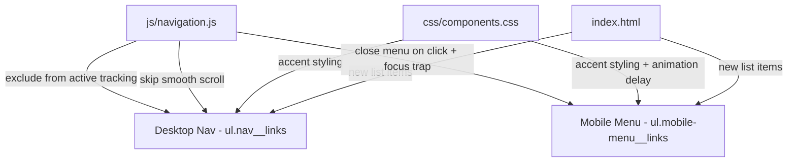

# Design Document: Download CV Menu

## Overview

This feature adds a "Download CV" link to both the desktop navigation bar (`ul.nav__links`) and the mobile overlay menu (`div.mobile-menu`). The link triggers a browser file download of `faizmazlan.cv.pdf` rather than navigating to a new page. It complements the existing hero-section download button by providing persistent access from any scroll position.

The implementation is intentionally lightweight — it requires only HTML additions, a small CSS extension, and targeted JS modifications to integrate with the existing navigation system (smooth scroll exclusion, active-section tracking exclusion, mobile menu close-on-click, focus trap inclusion, and staggered entrance animation).

## Architecture

The feature touches three layers of the existing codebase:



**Design decisions:**

1. **No new files** — The feature is small enough to integrate into existing HTML, CSS, and JS files. Creating new modules would add unnecessary complexity.
2. **Data attribute for identification** — The download links use a `data-download` attribute to distinguish them from section links. This avoids fragile class-name or href-based detection in JS.
3. **CSS-only visual distinction** — The accent colour styling uses a dedicated `.nav__link--download` modifier class (BEM convention matching the existing codebase) rather than inline styles.
4. **JS guard via href check** — The smooth scroll handler already checks `href.startsWith('#')`. Since the download link's href is `./faizmazlan.cv.pdf`, it naturally bypasses smooth scroll without additional logic.

## Components and Interfaces

### 1. HTML — Desktop Nav Download Link

A new `<li>` appended as the last child of `ul.nav__links`:

```html
<li>
  <a href="./faizmazlan.cv.pdf" download
     class="nav__link nav__link--download"
     aria-label="Download CV as PDF"
     data-download>
    Download CV
  </a>
</li>
```

### 2. HTML — Mobile Menu Download Link

A new `<li>` appended as the last child of `ul.mobile-menu__links`:

```html
<li>
  <a href="./faizmazlan.cv.pdf" download
     class="mobile-menu__link mobile-menu__link--download"
     aria-label="Download CV as PDF"
     data-download>
    Download CV
  </a>
</li>
```

### 3. CSS — `nav__link--download` modifier

```css
.nav__link--download {
  color: var(--color-accent);
}
.nav__link--download:hover {
  color: var(--color-accent-hover);
}
/* Remove the underline animation inherited from .nav__link */
.nav__link--download::after {
  display: none;
}
```

### 4. CSS — `mobile-menu__link--download` modifier

```css
.mobile-menu__link--download {
  color: var(--color-accent);
}
.mobile-menu__link--download:hover {
  color: var(--color-accent-hover);
}
```

### 5. CSS — Staggered animation delay for 8th mobile menu item

The existing CSS uses `nth-child` selectors up to the 7th child (Contact). The download link is the 8th child and needs a matching delay:

```css
.mobile-menu.is-open .mobile-menu__links li:nth-child(8) .mobile-menu__link {
  transition-delay: 640ms;
}
```

### 6. JS — Navigation module changes

**Active section tracking exclusion:** The `initActiveSectionTracking` function calls `setActiveLink(navLinks, id)` which iterates all `.nav__link` elements. The `setActiveLink` function must skip links that have the `data-download` attribute so they never receive `is-active` or `aria-current`.

**Smooth scroll exclusion:** The existing `initSmoothScroll` handler already returns early when `href` doesn't start with `#`. The download link's `href="./faizmazlan.cv.pdf"` naturally bypasses this — no change needed.

**Mobile menu close on download click:** The `initMobileMenu` function attaches close handlers to `mobileLinks` (queried as `.mobile-menu__link`). The new download link also has the `.mobile-menu__link` class, so it will be included in the `mobileLinks` NodeList automatically. However, `initSmoothScroll` is also called with `mobileLinks`, and the download link must not have `preventDefault()` called on it. The existing guard (`if (!href.startsWith('#')) return;`) already handles this.

**Focus trap inclusion:** The focus trap in `handleMenuKeydown` queries `mobileMenu.querySelectorAll('a, button, [tabindex]:not([tabindex="-1"])')`. The new download `<a>` element will be automatically included — no change needed.

### Summary of JS changes required

| Function | Change needed | Reason |
|---|---|---|
| `setActiveLink` | Skip elements with `[data-download]` | Prevent active-section styling on download link |
| `initSmoothScroll` | None | Existing `#` guard handles it |
| `initMobileMenu` close handlers | None | New link has `.mobile-menu__link` class |
| Focus trap | None | Queries all `<a>` elements in menu |

## Data Models

No data models are introduced. The feature is purely presentational — it adds static HTML anchor elements that point to an existing file. No state, storage, or data transformation is involved.


## Correctness Properties

*A property is a characteristic or behavior that should hold true across all valid executions of a system — essentially, a formal statement about what the system should do. Properties serve as the bridge between human-readable specifications and machine-verifiable correctness guarantees.*

### Property 1: Smooth scroll bypasses non-hash hrefs

*For any* anchor element whose `href` does not start with `#`, the smooth scroll click handler SHALL return early without calling `preventDefault()` or `scrollTo()`.

**Validates: Requirements 1.5**

### Property 2: Active section tracking never marks download links

*For any* valid section ID from the set {about, experience, skills, projects, education, certifications, contact}, calling `setActiveLink` with a collection of nav links that includes a download link (identified by `[data-download]`) SHALL never apply the `is-active` class or `aria-current` attribute to the download link.

**Validates: Requirements 4.1, 4.2**

## Error Handling

This feature has minimal error surface:

1. **Missing PDF file** — If `faizmazlan.cv.pdf` is deleted or renamed, the browser will show a 404 error on download. No JS error handling is needed since this is standard browser behavior for broken links. The build script should be updated to copy the PDF to `dist/`.

2. **JS not loaded** — The download link is a standard `<a>` with `href` and `download` attributes. It works without JavaScript. The only JS-dependent behaviors (active tracking exclusion, mobile menu close) degrade gracefully — the link still downloads the file.

3. **Browser download attribute support** — The `download` attribute is supported in all modern browsers. In older browsers that don't support it, the link will navigate to the PDF instead of downloading it, which is an acceptable fallback.

## Testing Strategy

### Unit Tests (vitest)

Example-based tests for structural and behavioral correctness:

| Test | What it verifies |
|---|---|
| Desktop download link exists as last nav item | Req 1.1 |
| Download link has correct href and download attribute | Req 1.2, 2.2 |
| Download link displays "Download CV" text | Req 1.3, 2.3 |
| Download link has aria-label "Download CV as PDF" | Req 5.1, 5.2 |
| Mobile download link exists as last mobile menu item | Req 2.1 |
| Mobile menu close is triggered on download link click | Req 2.5 |
| Download link is included in focus trap focusable elements | Req 2.6 |
| 8th child animation delay is 640ms | Req 3.1, 3.2 |

### Property Tests (vitest + fast-check)

Property-based tests for universal behavioral guarantees:

| Property | Iterations | What it verifies |
|---|---|---|
| Property 1: Smooth scroll bypass | 100+ | Non-hash hrefs never intercepted |
| Property 2: Active tracking exclusion | 100+ | Download links never marked active |

Each property test will be tagged with: **Feature: download-cv-menu, Property {number}: {property_text}**

The property tests will use `fast-check` (already a project dependency) to generate random section IDs and href strings, verifying the universal properties hold across all inputs.

### Manual Testing

- Verify accent colour styling visually in both light and dark themes
- Verify touch target size on mobile viewport (44×44px minimum)
- Verify staggered animation timing feels cohesive with existing links
- Verify file download works in Chrome, Firefox, and Safari
- Screen reader testing to confirm aria-label announcement
