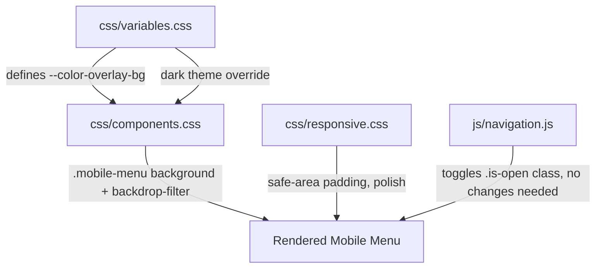

# Design Document: Mobile Menu Overlay

## Overview

This feature replaces the mobile navigation menu's solid background (`var(--color-bg-primary)`) with a semi-transparent overlay that includes a backdrop blur effect. The change is purely CSS-based — no JavaScript modifications are needed since the existing open/close logic, focus trap, and keyboard navigation in `js/navigation.js` operate on class toggles and the `hidden` attribute, which are unaffected by background styling.

The implementation introduces new CSS custom properties for the overlay colors in both light and dark themes, updates the `.mobile-menu` background declaration, and adds `backdrop-filter` / `-webkit-backdrop-filter` for the blur effect.

### Design Rationale

- **CSS custom properties approach**: New overlay-specific variables (`--color-overlay-bg`) are added to `:root` and `[data-theme="dark"]` rather than hardcoding rgba values in the component rule. This keeps the design token system consistent and makes future adjustments easy.
- **No JavaScript changes**: The existing `navigation.js` toggles `.is-open` and manages `opacity`/`visibility` transitions. Since we're only changing the `background` property value, all transitions, focus trapping, and keyboard handling continue to work without modification.
- **Backdrop blur with fallback**: `backdrop-filter` has broad modern browser support but requires the `-webkit-` prefix for Safari. The semi-transparent background alone provides adequate readability even if `backdrop-filter` is unsupported.

## Architecture



### Files Changed

| File | Change | Scope |
|---|---|---|
| `css/variables.css` | Add `--color-overlay-bg` to `:root` and `[data-theme="dark"]` | 2 new lines |
| `css/components.css` | Update `.mobile-menu` background; add `backdrop-filter` | ~3 lines changed |
| `css/responsive.css` | No changes needed | — |
| `js/navigation.js` | No changes needed | — |

## Components and Interfaces

### New CSS Custom Properties

Two new design tokens are introduced in `css/variables.css`:

```css
/* Light theme (in :root) */
--color-overlay-bg: rgba(255, 255, 255, 0.88);

/* Dark theme (in [data-theme="dark"]) */
--color-overlay-bg: rgba(0, 0, 0, 0.88);
```

**Design decisions:**
- **Opacity 0.88**: Chosen as the default within the 0.85–0.95 range. This provides enough transparency to hint at page content while keeping menu links clearly readable. The value sits closer to the lower end to make the overlay effect noticeable.
- **White-based for light, black-based for dark**: Matches the existing `--color-bg-primary` values (#FFFFFF and #000000) so the overlay feels like a natural extension of the theme.

### Updated `.mobile-menu` Component

In `css/components.css`, the `.mobile-menu` rule changes from:

```css
background: var(--color-bg-primary);
```

to:

```css
background: var(--color-overlay-bg);
backdrop-filter: blur(20px);
-webkit-backdrop-filter: blur(20px);
```

**Design decisions:**
- **Blur radius 20px**: Matches the existing `--blur-glass` token (20px) used by the site header's glassmorphism effect, creating visual consistency across the site. Falls within the required 10–30px range.
- **Vendor prefix**: `-webkit-backdrop-filter` is required for Safari support. Both declarations are included.
- **No separate fallback block needed**: If `backdrop-filter` is unsupported, the semi-transparent background at 0.88 opacity still provides sufficient contrast for readability. The menu remains fully functional.

### Contrast Analysis

**Light theme:**
- Background: `rgba(255, 255, 255, 0.88)` — effective color over white content is near-white
- Text: `--color-text-primary` = `#1D1D1F` (near-black)
- Contrast ratio: ~18:1 (well above 4.5:1 WCAG AA requirement)

**Dark theme:**
- Background: `rgba(0, 0, 0, 0.88)` — effective color over dark content is near-black
- Text: `--color-text-primary` = `#F5F5F7` (near-white)
- Contrast ratio: ~18:1 (well above 4.5:1 WCAG AA requirement)

Even with varied page content bleeding through at 12% visibility, the high-opacity overlay ensures the worst-case contrast remains above 4.5:1.

## Data Models

No data models are involved. This feature is purely presentational CSS.

## Error Handling

### Browser Compatibility

| Scenario | Behavior |
|---|---|
| `backdrop-filter` not supported | Menu renders with semi-transparent background only (no blur). Readability is preserved by the 0.88 opacity. |
| CSS custom properties not supported | Extremely old browsers — the menu falls back to whatever the browser's default handling is. This is acceptable given the site's modern target audience. |

### Edge Cases

- **Transparent content behind overlay**: If the page has very light or very dark sections, the overlay's 0.88 opacity ensures the menu text remains readable regardless.
- **Reduced motion preferences**: No new animations are introduced. The existing `opacity`/`visibility` transitions are unchanged.
- **Safe area insets**: The existing `env(safe-area-inset-*)` padding in `responsive.css` continues to work since it's applied to the same `.mobile-menu` element.

## Testing Strategy

**Property-based testing is not applicable** for this feature. The changes are purely CSS visual styling (background color and backdrop-filter). There are no functions with inputs/outputs, no data transformations, and no business logic to test with generated inputs. The feature falls into the "UI rendering and layout" category where PBT does not apply.

### Manual Testing Checklist

Since this is a CSS-only change on a vanilla HTML/CSS/JS site with no test framework, verification is manual:

1. **Visual verification (light theme)**:
   - Open the site on a mobile viewport (≤768px)
   - Open the mobile menu via hamburger button
   - Verify page content is partially visible behind the menu
   - Verify menu links are clearly readable
   - Verify blur effect softens background content

2. **Visual verification (dark theme)**:
   - Toggle to dark theme
   - Repeat the above checks
   - Verify the overlay uses a dark semi-transparent color

3. **Transition verification**:
   - Open and close the menu repeatedly
   - Verify smooth opacity/visibility transitions (no flash of solid color)

4. **Functionality verification**:
   - Click a menu link → menu closes, page scrolls to section
   - Press Escape → menu closes, focus returns to hamburger
   - Tab through menu → focus stays trapped within menu and hamburger
   - Verify hamburger animates to X and back

5. **Cross-browser verification**:
   - Test in Chrome, Firefox, Safari (for `-webkit-backdrop-filter`)
   - Test on an actual mobile device if possible

6. **Contrast spot-check**:
   - Use browser DevTools to inspect computed background
   - Verify text remains legible over various page sections
